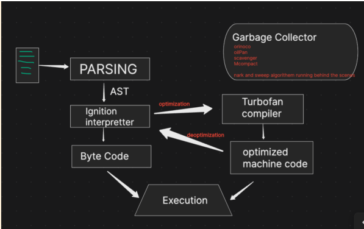

# hey-nodejs
Just to learn the nodejs all concepts

# Definition

- JS Runtime Environment built on V8 JS Engine
- Cross Platform / Open Source
- Event driven Architecture , Capable of Asynchronous I/O (Non Blocking I/O)
- Handled by OpenJS Foundation (First Developed by Ryan Dahl in 2009)
- Written in C++ (V8 --> C++ Program)
- An C++ application with V8 Engine embedded into it
- NodeJS (V8 Engine + Super powers like API on Server and many more)
- ECMAScript - Standard which is followed by JS and also by V8 Engine

# Starter

- Node version (Above 16 - V16.20.2)
- NPM Version (Above 8 - V8.19.4)
- Node REPL (Read, Evaluate, Print, Loop)
- 'node' - command to use to create JS runtime environment (Behind scene it will use V8 engine to execute JS)
           It is very similar to browser console

# Global Object

- In browser (this, self, frames ) referes to window (global object)
- In NodeJS - Global object is (global) and (this) refers to blank object
- globalThis - New Global object, Standard conviction for all browser and JS Run time Environment
- In NodeJS - globalThis === global (which is true). 

# Module & Require

- Node.js modules are reusable pieces of code that encapsulate related functionality and can be imported and used in other parts of a Node.js application
- They can be imported using the require() function, which allows access to the exported functionality.
- Modules can be created using the module.exports object to expose functions, objects, or values to other parts of the application.
- You can access other modules variable and function until unless they are exported
- By Default Modules are protected.
- To exports multiple function or variable then you have to wrap it in object
- Modules can be built-in Node.js modules, third-party modules installed via npm, or custom modules created by the developer.
- Modules help in separating concerns and promoting maintainability and scalability in Node.js applications.
- They promote code organization, modularity, and reusability.
- Require is used to load external modules or files in Node.js.
- Require provides a way to include external functionality into your application.
    * @requires module_name - The name of the module or file to be loaded.
    * @returns {Object} - The loaded module or file.
    * @throws {Error} - If the module or file cannot be found or loaded.
- We can also create a folder with an index.js file in it, which is responsible for exporting all the functions present in multiple files within the folder.

# How Module and Require Works Internally

- All the code of the module is wrapped inside a function called an IIFE (Immediately Invoked Function Expression), which is a self-executing anonymous function that is used to create a new scope for the module and prevent polluting the global scope.
  ```javascript
    (function (exports, require, module, __dirname, __filename) {
      // code of the module (js files) 
    })()  
  ```
- Different parameter like module, require passed to the function (IIFE) by nodejs & then pass to the V8 Engine.
- require(path)
  1. Resolving the path and module (json, js, node:module etc)
  2. Loads the module (Content according to the file type)
  3. Wraps inside the IIFE (Compile process)
  4. Evaluation (module.exports)
  5. Caching (If any module imports or require into multiple module then nodejs processed and cached it once & uses cached data into another module).

# CJS vs MJS

- **CJS (CommonJS)**
  - By default Used in Node.js or type in package.json will be commonjs.
  - Synchronous module loading.
  - Uses `require()` to import modules.
  - Uses `module.exports` to export modules.
  - Example:
    ```javascript
    // Importing a module
    const module = require('module_name');

    // Exporting a module
    module.exports = {
      functionName,
      variableName
    };
    ```

- **MJS (ES Modules)**
  - Used in modern JavaScript (ES6+) or type in package.json will be module.
  - Asynchronous module loading.
  - Uses `import` to import modules & Uses `export` to export modules.
  - Example:
    ```javascript
    // Importing a module
    import { functionName, variableName } from 'module_name';

    // Exporting a module
    export const functionName = () => { ... };
    export const variableName = 'value';
    ```

# Libuv & Async I/O (Non Blocking I/O)
  - JavaScript is a synchronous, single-threaded language, meaning there is only one thread in which the JavaScript engine (such as the V8 engine) runs. In JavaScript, code is executed line by line within this single thread.

  - So, if you're executing line 2 in JavaScript, it will only run after line 1 has finished executing. This is the essence of synchronous execution: each task is performed one after the other, without overlap.

  - So, JavaScript itself is synchronous, but with the power of Node.js, it can handle asynchronous operations, allowing JavaScript to perform multiple tasks
  concurrently.

  - The JS engine gains its superpowers from Node.js. Node.js grants these powers through a library named Libuv—our superhero.

  - The JS engine cannot directly access OS files, so it calls on Libuv. Libuv, communicates with the OS, performs all the necessary tasks, and then returns the response to the JS engine. He offloads the work and does wonders behind the scene.

  - Example:- 
    ```javascript
      let a = 10; let b = 20;
      
      https.get("https://api.fbi.com/", (res) => { console.log(res)}); // Handled By Libuv
      // (res) => { console.log(res)} => callback(A)

      setTimeout(()=> {console.log("timeout")}); // Handled By Libuv
      // ()=> {console.log("timeout")} => callback(B)

      fs.readFile("./abc.text", (data) => { console.log(data)}); // Handled By Libuv
      // (data) => { console.log(data)} => callback(C)

      function multiply(x,y) {return a*b;}
      let c  = multiply(a,b);
      console.log(c);
    ```
  - Steps:- 
    - The variables let a and let b are executed within the GEC (Global Execution Context) during the synchronous phase of the code execution process.

    - However, when the code encounters an API call, the V8 engine, while still operating within the GEC, recognizes that it's dealing with an asynchronous  operation. At this point, the V8 engine signals libuv to handle this API call.

    - What happens next is that libuv registers this API call, including its associated callback function (name - A), within its event loop, allowing the V8 engine to continue executing the rest of the code without waiting for the API call to complete.

    - Next, when the code encounters a setTimeout function, a similar process occurs.

    - The V8 engine identifies this as another asynchronous operation and once again notifies libuv.

    - Following this, when the code reaches a file operation (like reading orwriting a file), the process is similar. The V8 engine recognizes this as another asynchronous task and alerts libuv . libuv then registers the file operation and its callback (C) in the event loop.

    - Next, when the code executes let c = multiplyFn(a, b); , the JavaScript engine creates a new function context for multiplyFn and pushes it onto the call stack.

    - The JavaScript engine handles this operation as part of the synchronous code execution.

    - Once the multiplyFn completes its execution and returns the result, the function context is popped off the call stack, and the result is assigned to the variable c

  - Imp concept :
    - When the function execution context is popped off the call stack, the garbage collector may clear any memory allocated for that context in the memory heap, if it is no longer needed.

    - After console.log(c) is executed and the value of c is printed to the console,the global execution context will also eventually be removed from the call stack if the code execution is complete.

    - With the global context popped off the call stack, the JavaScript engine has finished processing, and the program ends.

    - Now the call stack becomes empty, the JavaScript engine can relax, as there is no more code to execute.

  - At this point, libuv takes over the major tasks. It handles operations such as processing timers, managing file system calls, and communicating with the operating system.
  - libuv performs these heavy tasks in the background, ensuring that asynchronous operations continue to be managed effectively. In summary, Node.js excels in handling asynchronous I/O operations, thanks to its non-blocking I/O model.

# Sync Async / Blocking Non Blocking Code

  - **fs.readFile("path", encoding, callback)**
    - Aysnc function which not Block the main thread and JS Engine's transfer it to Libuv to execute.
    - After reading the file libuv update the JS Engine and execute the callback.
  
  - **fs.readFileSync("path", encoding, callback)**
    - Sync function which Block the main thread until the file is completely read.
    - It is still transfer to Libuv by JS Engine's to execute because file system task can't be accessible by JS Engine V8.
    - They don't have callback function because it is blocking the main thread.
    - As a developer, it’s important to understand that while Node.js and the V8 engine give you the capability to block the main thread using synchronous methods, this is generally not recommended.
    - Example of sync function like fs.readFileSync(), crypto.pbkdf2Sync() etc.

  - **setTimeout(0)**
    - Trust Issues with setTimeout(0) : When you ask the code to run after 0 milliseconds, it doesn't necessarily run immediately after that time. It runs only when the call stack of the main thread is empty. This introduces some "terms and conditions," meaning that the actual execution timing is dependent on the state of the call stack.
    - This means that even if you specify a 0-millisecond delay, the callback will only execute after the global execution context is done.

  *Note* :- UTF-8 (Uniform Transformation Format 8-bit), is a character encoding standard that used for electronic communication. An encoding defines a mapping between bytes and text. Encoding is important as we consider the contents of a file to be in text format. As the utf-8 encoding is most common & covers nearly all characters of human languages, it is necessary to pass it as the options parameter to the fs.readFile().

# V8 JS Engine

  - When JavaScript code is executed, it goes through several stages in the V8 engine:-
    
    **Parsing Stage:-**

    1. **Lexical Analysis and Tokenization**
      - The main goal of lexical analysis is to break down the raw JavaScript code into manageable pieces called tokens. Each token represents a fundamental element of the language, such as keywords, operators, identifiers, and literals.
        Eg:- var a = 10; tokens = ['var', 'a', '=', '10', ';' ]

    2. **Syntax Analysis and Abstract Syntax Tree (AST)**
      - The tokens are converted into an Abstract Syntax Tree (AST). This process is crucial for transforming the flat list of tokens into a structured representation of the code. (https://astexplorer.net/)  to check the AST Tree.
        var a = 10;
        Variable Declaration
          |_ Identifier(a)
          |_ Literal (10)

      - **Syntax Errors** : When the V8 engine reads code, it processes tokens one by one. If an unexpected token is encountered that does not fit the grammar rules, a syntax error occurs. This is because the AST cannot be generated if the code does not adhere to the expected syntax, indicating that something is wrong with the structure of the code.
    
    **Interpreter & Compilation**
    1. Interpreted Language :- These languages are executed line by line. The interpreter reads and executes the code directly, which can lead to slower execution times compared to compiled languages. eg:- Python.
      - Pros :- Faster to start executing code, easier to debug
      - Cons :- Slower execution compared to compiled languages because of the lineby-line interpretation
    
    2. Compiled Languages :- These languages are first translated into machine code (binary code) through a process called compilation. The machine code is then executed by the computer’s hardware, leading to faster execution times. eg:- C, C++.
      - Pros :- Faster execution because the code is pre-compiled into machine code.
      - Cons :- Longer initial compilation time, more complex debugging process.

    3. **JavaScript is neither purely interpreted nor purely compiled. It utilizes a combination of both techniques**
      - Initial Execution by INTERPRETER: JavaScript uses an interpreter to execute code quickly and start running the script. This allows for rapid execution of scripts and immediate feedback.

      - Just-In-Time (JIT) Compilation: JavaScript engines like V8 use JIT compilation to improve performance. JIT compilation involves compiling code into machine code at runtime, just before execution. This process optimizes performance by compiling frequently executed code paths into optimized machine code.

      - (JS CODE) -> (Initial Interpretation line by line) -> (Execution) -> (JIT Compilation ,optimization) -> (Machine Code Execution)

    4. 

    5. **Optimization:** TurboFan converts the bytecode into optimized machine code, which improves performance for repeated executions.

    6. **Deoptimization:** If TurboFan’s assumptions are incorrect (e.g., a function that was optimized for numbers receives strings), the optimization may fail. In such cases, TurboFan will deoptimize the code and revert it to a less optimized state. The code is then sent back to Ignition for further interpretation and possible re-optimization.

    7. **Hot Code:** Refers to code that is executed frequently. TurboFan focuses on optimizing hot code to improve performance.

    8. **Ignition:** Converts the AST into bytecode. Bytecode is a lower-level, intermediate representation of the code that the JavaScript engine can execute more efficiently than raw source code. Ignition reads and executes the bytecode line by line.

    9. **TurboFan:** A compiler within the V8 engine that optimizes frequently executed (hot) code paths. When Ignition identifies a portion of the code that runs frequently (hot code), it sends this code to TurboFan for optimization.

  **Best Practice:**  For optimal performance, try to pass consistent types and values to functions. For example, if a function is optimized for numeric
  calculations, avoid passing strings to prevent deoptimization


# Libuv & Event Loop


